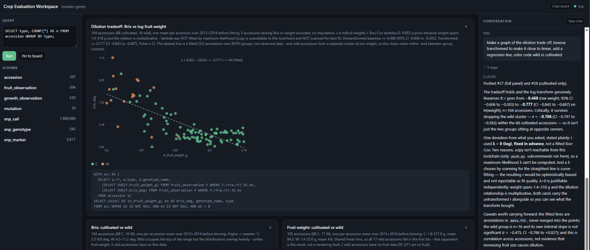
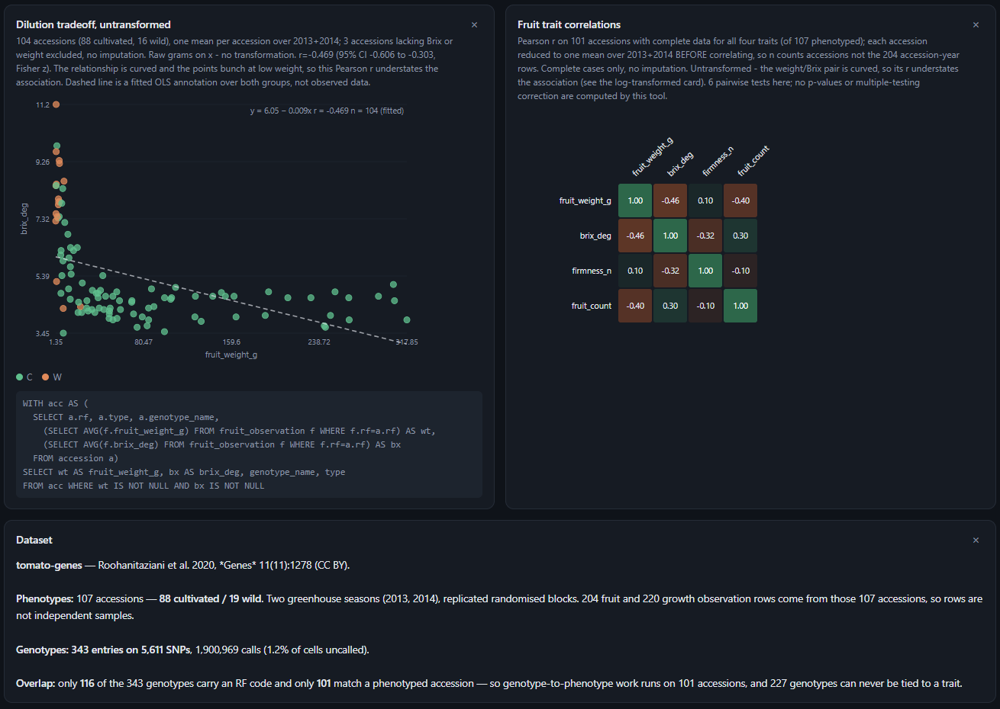
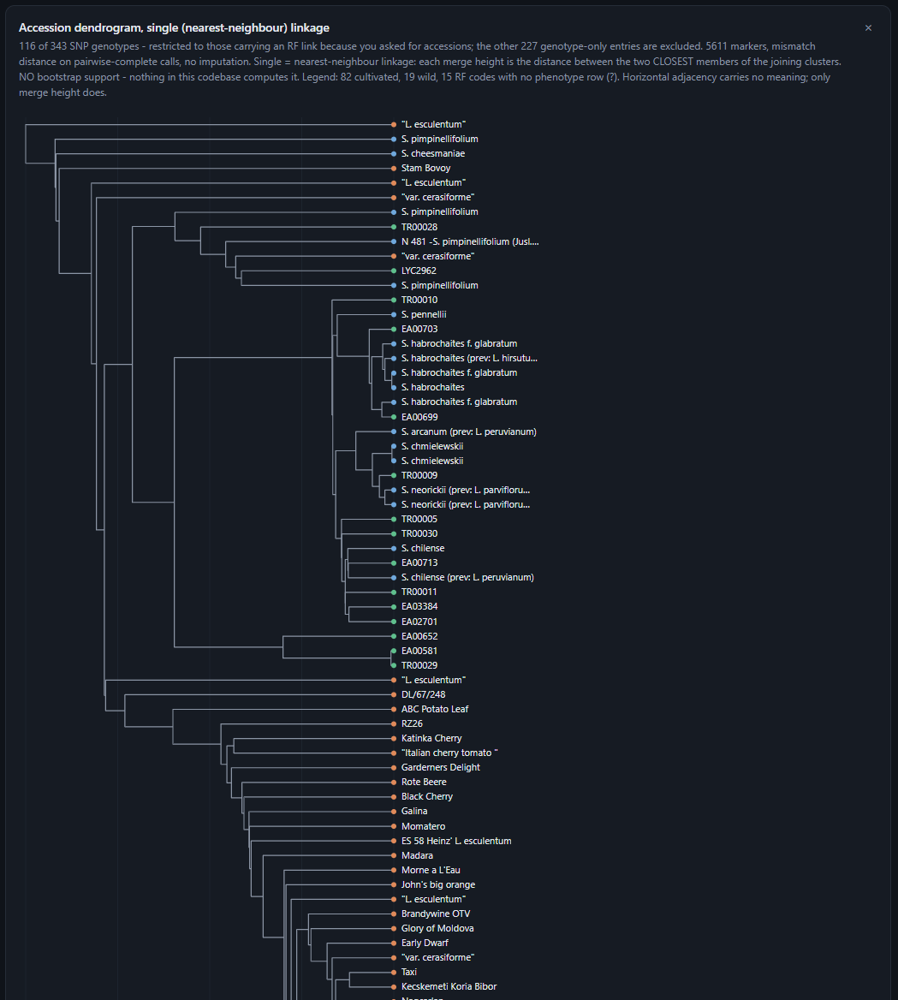
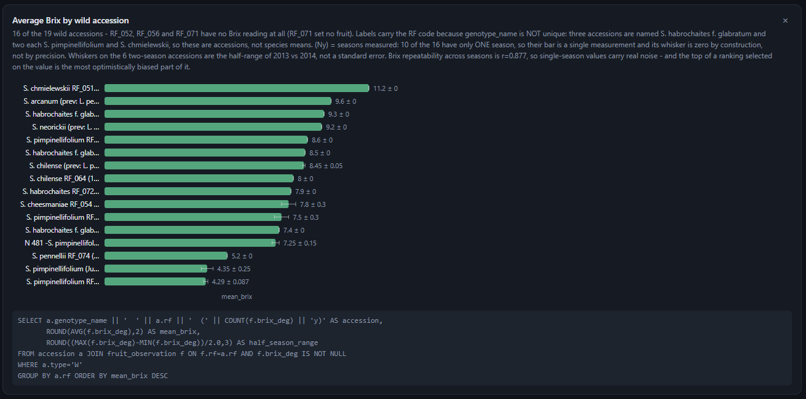
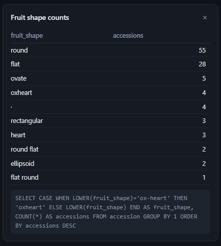
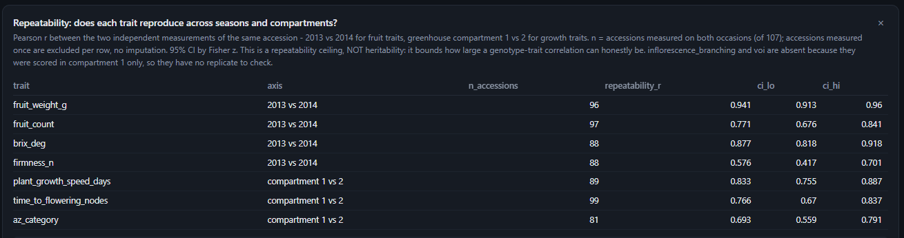

# Crop Evaluator

An experimental prototype of an AI workspace for crop evaluation: messy trial data goes in, and you get a
local dashboard you can ask questions in plain English — the answers come back as
charts, tables, and trees built from the data.

It ships with a real dataset (a 107-accession tomato core collection) and runs entirely
on your own machine against the Claude Code you already have installed.



Ask a question on the right; the answer lands on the board as a card carrying the SQL that
produced it and the caveats that qualify it.

<table>
<tr>
<td width="50%"></td>
<td width="50%"></td>
</tr>
<tr>
<td>Trait correlations and the Brix/fruit-weight tradeoff.</td>
<td>Accessions clustered by SNP genotype, wild separating from cultivated.</td>
</tr>
<tr>
<td></td>
<td></td>
</tr>
<tr>
<td>Sweetness across the wild relatives — ranked, but with the single-season bars marked.</td>
<td>Messy source values normalised in the query, not silently at ingestion.</td>
</tr>
</table>



Because the answers are only as good as the measurements, the agent will check how well a
trait even reproduces before drawing conclusions from it.

Card types are table, bar, scatter, histogram, correlation heatmap, dendrogram, and
markdown note — all hand-rendered SVG, no charting library.

## Requirements

- **Python 3.11+** (developed on 3.12)
- **[Claude Code](https://claude.com/claude-code)**, installed and signed in — check
  with `claude --version`. The chat panel shells out to your local `claude`, so it uses
  the account you're already logged into and bills exactly as a terminal session would.

Optionally, the [`sqlite3` command-line tool](https://sqlite.org/download.html) — a
nice-to-have if you want to poke around the ingested database yourself
(`sqlite3 data/tomato-genes/data.db ".schema"`). The app doesn't need it; Python's
`sqlite3` module is stdlib and already covers everything the dashboard does.

## Start

```bash
git clone <this-repo>
cd crop-evaluator
pip install -r requirements.txt
cd app
python server.py
```

Then open **http://127.0.0.1:8000**

The tomato database is committed, so there is no ingestion or build step — a fresh
clone runs as-is.

> Run it from `app/`, not the repo root. `server.py` imports its sibling modules
> directly and won't resolve them otherwise.

Optional environment variables:

| variable | default | effect |
|---|---|---|
| `PORT` | `8000` | port to bind on loopback (the URL changes to match) |
| `DATASET` | `tomato-genes` | which directory under `data/` to load |
| `IDLE_EXIT_MIN` | `30` | minutes with no browser before the server exits; `0` never exits |

## Shut down

Press **Ctrl-C** in the terminal running the server.

```bash
# verify nothing is left listening
# macOS / Linux
lsof -i :8000
# Windows PowerShell
Get-NetTCPConnection -State Listen -LocalPort 8000
```

The port is released immediately in every case, so you can always restart right away.

One wrinkle: **if a browser tab is still open on the page, the process itself may not
exit.** The page holds a Server-Sent Events stream open to receive live updates, and
uvicorn's graceful shutdown waits for that stream to finish, which it never does on its
own. A second Ctrl-C doesn't help. Closing the tab makes it exit immediately, so
either close the tab first or close it after pressing Ctrl-C.

If you'd rather not think about it, the server also stops on its own 30 minutes after
the last browser disconnects, and terminates any headless `claude` it started.

## Security

Single-user, local-only by design. The server binds `127.0.0.1`, rejects any
non-loopback client, and validates the `Host` header to block DNS rebinding. It never
reads, stores, or transmits an API key — it invokes the `claude` binary on your PATH.
Machine detail (home directory, username, absolute paths) is stripped from anything
that reaches the browser or disk.

There is **no authentication**, so don't change the bind address or expose the port.

`app/.state.json` holds your board and full conversation text and is gitignored.

See [`app/README.md`](app/README.md) for the full security model, including the honest
limits of the agent's tool restrictions.

## Layout

```
app/         the dashboard — server, analytics, card-push CLI, static page
data/        datasets; each holds its sources, a data.db, and a semantics.md
methods/     analysis-guide.md — statistical and genomic method guidance the
             chat agent reads before any analysis, distilled from open-access
             sources and from what this codebase can actually do
screenshots/ the images used in this README
ingest.md    instructions an LLM follows to ingest a new messy dataset
CLAUDE.md    orientation for coding agents working in this repo
```

## Adding your own data

Drop your files in `data/<name>/`, optionally add an `instructions.md` saying how to
treat them, then point Claude Code at [`ingest.md`](ingest.md). It builds a `data.db`
plus a `semantics.md` recording what each column means, what units it uses, and which
direction each score runs. Start the server with `DATASET=<name>`.

Source values are preserved verbatim and normalised in the query, so cleaning decisions
stay visible rather than disappearing into the ingest.

## Data attribution

The bundled dataset is the supplementary material from Roohanitaziani et al. (2020),
*Exploration of a Resequenced Tomato Core Collection for Phenotypic and Genotypic
Variation in Plant Growth and Fruit Quality Traits*, **Genes** 11(11):1278 —
open access under CC BY. <https://www.mdpi.com/2073-4425/11/11/1278>

## Status

Prototype. It is a working demonstration of the ingestion → dashboard → chat loop, not
a product.
